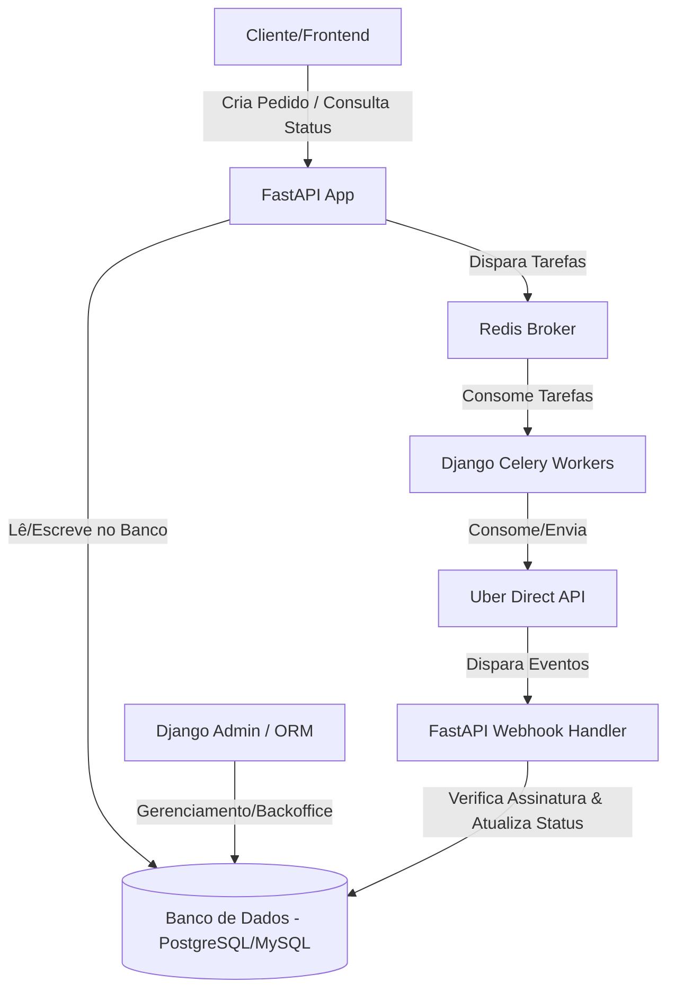

# Guia Completo de Integração: Uber Direct API com FastAPI + Django

Este documento apresenta a arquitetura, endpoints, fluxo de autenticação, modelagem de banco de dados e exemplos práticos de código para integrar o **Uber Direct API** em um ecossistema misto de **Django** (gerenciamento de banco de dados, ORM, painel administrativo e tarefas em segundo plano) e **FastAPI** (APIs de alta performance e processamento assíncrono de Webhooks).

---

## 1. Visão Geral do Uber Direct no Brasil

O **Uber Direct** é a solução de logística *last-mile* *white-label* da Uber. Ele permite que você use a frota de entregadores parceiros da Uber para realizar entregas diretamente do seu e-commerce ou aplicativo, mantendo o controle total da experiência do cliente.

### Fluxo Operacional:
1. **Criação de Cotação (Quote):** O sistema envia a origem, destino e itens do pedido para obter o valor estimado da entrega e a viabilidade.
2. **Criação da Entrega (Delivery):** O sistema confirma a entrega usando o ID da cotação gerada previamente.
3. **Acompanhamento (Webhooks):** O Uber envia notificações de alteração de status (ex: entregador a caminho, chegou no local, entrega concluída) para o seu servidor.
4. **Rastreamento em Tempo Real:** A API retorna uma URL pública de rastreamento (`tracking_url`) que pode ser enviada por SMS/WhatsApp para o cliente final.

---

## 2. Arquitetura da Integração (FastAPI + Django)

Em um sistema que utiliza ambos os frameworks, dividimos as responsabilidades da seguinte forma para obter o melhor de cada um:



### Divisão de Responsabilidades:
*   **Django (Backoffice & Persistência):**
    *   Gerenciamento das tabelas e relacionamentos através do Django ORM.
    *   Painel administrativo para controle financeiro e auditoria de entregas.
    *   Execução de tarefas agendadas e pesadas via **Celery** (ex: conciliação financeira de faturas com a Uber).
*   **FastAPI (Performance & Tempo Real):**
    *   Criação rápida de cotações em tempo real para os clientes no checkout.
    *   Endpoint assíncrono para recebimento de **Webhooks** da Uber (alta volumetria e baixa latência).
    *   Compartilhamento de dados conectando-se diretamente ao mesmo banco de dados PostgreSQL/MySQL utilizando o Django ORM (ou via consultas assíncronas assinaladas).

---

## 3. Fluxo de Autenticação (OAuth 2.0)

A API do Uber utiliza o protocolo OAuth 2.0 com o tipo de concessão `client_credentials`.
*   **Endpoint de Token:** `https://auth.uber.com/oauth/v2/token`
*   **Escopo Requerido:** `eats.deliveries`
*   **Duração:** O token geralmente é válido por um longo período (aproximadamente 30 dias). É altamente recomendado **cachear** o token (no Redis ou banco de dados) e só solicitar um novo se estiver expirado ou falhar com HTTP 401.

### Parâmetros de Requisição (POST):
*   `client_id`: ID fornecido no painel do desenvolvedor Uber.
*   `client_secret`: Chave secreta do painel.
*   `grant_type`: `client_credentials`
*   `scope`: `eats.deliveries`

---

## 4. Endpoints Principais da API

Todas as chamadas requerem o cabeçalho `Authorization: Bearer <SEU_TOKEN>` e a URL base depende do ambiente:
*   **Sandbox:** `https://api.uber.com` (use para testes e simulações)
*   **Produção:** `https://api.uber.com`

*Nota: O identificador `{customer_id}` é gerado quando sua conta corporativa é criada e está disponível no painel da Uber.*

### 1. Criar Cotação (Create Quote)
*   **Método:** `POST`
*   **URL:** `/v1/customers/{customer_id}/delivery_quotes`
*   **Descrição:** Valida endereços, verifica cobertura física de entregadores e retorna o preço.
*   **Exemplo de Payload:**
    ```json
    {
      "pickup": {
        "store_id": "uber-store-uuid-ou-id"
      },
      "dropoff_address": {
        "formatted_address": "Av. Paulista, 1000 - Bela Vista, São Paulo - SP, 01310-100",
        "apt_floor_suite": "Apto 42"
      },
      "pickup_times": [0]
    }
    ```
    *Dica: `pickup_times: [0]` indica que a entrega deve ser cotada para o momento atual (ASAP).*

### 2. Confirmar Entrega (Create Delivery)
*   **Método:** `POST`
*   **URL:** `/v1/customers/{customer_id}/deliveries`
*   **Descrição:** Efetiva o pedido de entrega usando a cotação obtida.
*   **Exemplo de Payload:**
    ```json
    {
      "estimate_id": "dqt_AI6aDfhsSNqsVNTG03QKxg",
      "external_order_id": "LOJA_PEDIDO_98765",
      "pickup": {
        "location": {
          "address": "Av. Brigadeiro Luís Antônio, 2500 - São Paulo, SP"
        },
        "contact": {
          "name": "Restaurante Central",
          "phone": "+5511999998888"
        }
      },
      "dropoff": {
        "location": {
          "address": "Av. Paulista, 1000 - Bela Vista, São Paulo, SP"
        },
        "contact": {
          "name": "João Silva",
          "phone": "+5511977776666"
        },
        "dropoff_notes": "Deixar com o porteiro na recepção."
      },
      "order_items": [
        {
          "name": "Hambúrguer Gourmet Double",
          "quantity": 1,
          "price": 3500,
          "currency_code": "BRL"
        }
      ],
      "order_summary": {
        "total_value": 3500,
        "currency_code": "BRL"
      }
    }
    ```
    *Importante: Os preços (`price` e `total_value`) devem ser representados em centavos (ex: R$ 35,00 = `3500`).*

### 3. Consultar Status da Entrega (Get Delivery)
*   **Método:** `GET`
*   **URL:** `/v1/customers/{customer_id}/deliveries/{delivery_id}`
*   **Descrição:** Retorna os detalhes atuais de uma entrega ativa (localização do entregador, status, etc.).

### 4. Cancelar Entrega (Cancel Delivery)
*   **Método:** `POST`
*   **URL:** `/v1/customers/{customer_id}/deliveries/{delivery_id}/cancel`
*   **Descrição:** Cancela a entrega. Sujeito a taxas de cancelamento dependendo do estágio em que a corrida se encontra.

---

## 5. Modelagem de Banco de Dados (Django ORM)

Aqui está a estrutura de tabelas sugerida para persistir os dados no banco de dados e gerenciar o ciclo de vida dos pedidos integrados ao Uber Direct.

Crie ou adapte no arquivo `models.py` da sua aplicação Django:

```python
from django.db import models
from django.utils.translation import gettext_lazy as _

class Store(models.Model):
    """Representa a filial física que despachará os pedidos."""
    name = models.CharField(max_length=255)
    uber_store_id = models.CharField(max_length=255, unique=True, help_text="ID da loja fornecido pela Uber")
    address = models.CharField(max_length=512)
    phone = models.CharField(max_length=20)
    created_at = models.DateTimeField(auto_now_add=True)

    def __str__(self):
        return self.name

class DeliveryOrder(models.Model):
    """Representa o Pedido de Entrega associado a um pedido do E-commerce."""
    
    class StatusChoices(models.TextChoices):
        CREATED = 'CREATED', _('Criado')
        PENDING = 'PENDING', _('Pendente de Aceite')
        SCHEDULED = 'SCHEDULED', _('Agendado')
        EN_ROUTE_TO_PICKUP = 'EN_ROUTE_TO_PICKUP', _('Entregador a caminho da Coleta')
        ARRIVED_AT_PICKUP = 'ARRIVED_AT_PICKUP', _('Entregador no local de Coleta')
        EN_ROUTE_TO_DROPOFF = 'EN_ROUTE_TO_DROPOFF', _('Entregador a caminho da Entrega')
        ARRIVED_AT_DROPOFF = 'ARRIVED_AT_DROPOFF', _('Entregador no local da Entrega')
        COMPLETED = 'COMPLETED', _('Entregue com Sucesso')
        FAILED = 'FAILED', _('Falhou')
        CANCELED = 'CANCELED', _('Cancelado')
        RETURNED = 'RETURNED', _('Retornado à Loja')

    # Chaves e Identificadores
    external_order_id = models.CharField(max_length=100, unique=True, help_text="ID do pedido no seu sistema")
    uber_delivery_id = models.CharField(max_length=255, blank=True, null=True, unique=True, help_text="ID retornado pela Uber")
    uber_quote_id = models.CharField(max_length=255, blank=True, null=True, help_text="ID da cotação gerada no checkout")
    
    # Detalhes Financeiros e Operacionais
    delivery_fee = models.DecimalField(max_digits=10, decimal_places=2, help_text="Custo cobrado pela Uber")
    status = models.CharField(max_length=50, choices=StatusChoices.choices, default=StatusChoices.CREATED)
    tracking_url = models.URLField(max_length=512, blank=True, null=True, help_text="Link para o cliente rastrear")
    
    # Timestamps
    created_at = models.DateTimeField(auto_now_add=True)
    updated_at = models.DateTimeField(auto_now=True)

    def __str__(self):
        return f"Entrega {self.external_order_id} - {self.get_status_display()}"

class DeliveryHistory(models.Model):
    """Histórico de atualizações de status enviado pelos webhooks."""
    delivery_order = models.ForeignKey(DeliveryOrder, on_delete=models.CASCADE, related_name='history')
    status_from = models.CharField(max_length=50)
    status_to = models.CharField(max_length=50)
    raw_payload = models.JSONField(help_text="Payload completo enviado pelo Webhook para auditoria")
    created_at = models.DateTimeField(auto_now_add=True)

    class Meta:
        ordering = ['-created_at']
```

---

## 6. Implementação Prática do Código

### A. Cliente da API Uber Direct (`uber_client.py`)
Utiliza `httpx` assíncrono para fácil integração com o FastAPI (e pode ser executado em tarefas assíncronas do Celery).

```python
import httpx
from typing import Dict, Any, Optional
import time

class UberDirectClient:
    def __init__(self, client_id: str, client_secret: str, customer_id: str, sandbox: bool = True):
        self.client_id = client_id
        self.client_secret = client_secret
        self.customer_id = customer_id
        self.base_url = "https://api.uber.com"
        self.auth_url = "https://auth.uber.com/oauth/v2/token"
        
        # Simples mecanismo de cache em memória (Idealmente usar Redis)
        self._token: Optional[str] = None
        self._token_expires_at: float = 0.0

    async def get_access_token(self) -> str:
        """Obtém o Token OAuth utilizando client_credentials"""
        # Retorna se ainda for válido (margem de 60 segundos)
        if self._token and time.time() < (self._token_expires_at - 60):
            return self._token

        data = {
            "client_id": self.client_id,
            "client_secret": self.client_secret,
            "grant_type": "client_credentials",
            "scope": "eats.deliveries"
        }
        
        async with httpx.AsyncClient() as client:
            response = await client.post(self.auth_url, data=data)
            if response.status_code != 200:
                raise Exception(f"Falha na autenticação com a Uber: {response.text}")
            
            res_data = response.json()
            self._token = res_data["access_token"]
            # Uber Direct tokens duram bastante tempo. Usamos expires_in da resposta.
            self._token_expires_at = time.time() + res_data.get("expires_in", 2592000)
            return self._token

    async def _get_headers(self) -> Dict[str, str]:
        token = await self.get_access_token()
        return {
            "Authorization": f"Bearer {token}",
            "Content-Type": "application/json"
        }

    async def create_quote(self, store_id: str, address_str: str) -> Dict[str, Any]:
        """Cria uma cotação de frete (Estimate)"""
        url = f"{self.base_url}/v1/customers/{self.customer_id}/delivery_quotes"
        payload = {
            "pickup": {
                "store_id": store_id
            },
            "dropoff_address": {
                "formatted_address": address_str
            },
            "pickup_times": [0]
        }
        
        headers = await self._get_headers()
        async with httpx.AsyncClient() as client:
            response = await client.post(url, json=payload, headers=headers)
            response.raise_for_status()
            return response.json()

    async def create_delivery(self, quote_id: str, external_order_id: str, pickup_details: dict, dropoff_details: dict, items: list) -> Dict[str, Any]:
        """Confirma a cotação e agenda a entrega física"""
        url = f"{self.base_url}/v1/customers/{self.customer_id}/deliveries"
        
        # Calcula soma total dos itens em centavos
        total_value = sum(item["price"] * item["quantity"] for item in items)
        
        payload = {
            "estimate_id": quote_id,
            "external_order_id": external_order_id,
            "pickup": pickup_details,
            "dropoff": dropoff_details,
            "order_items": items,
            "order_summary": {
                "total_value": total_value,
                "currency_code": "BRL"
            }
        }
        
        headers = await self._get_headers()
        async with httpx.AsyncClient() as client:
            response = await client.post(url, json=payload, headers=headers)
            response.raise_for_status()
            return response.json()

    async def get_delivery_status(self, delivery_id: str) -> Dict[str, Any]:
        """Consulta o status atual do pedido no Uber Direct"""
        url = f"{self.base_url}/v1/customers/{self.customer_id}/deliveries/{delivery_id}"
        headers = await self._get_headers()
        async with httpx.AsyncClient() as client:
            response = await client.get(url, headers=headers)
            response.raise_for_status()
            return response.json()

    async def cancel_delivery(self, delivery_id: str) -> Dict[str, Any]:
        """Solicita o cancelamento da entrega"""
        url = f"{self.base_url}/v1/customers/{self.customer_id}/deliveries/{delivery_id}/cancel"
        headers = await self._get_headers()
        async with httpx.AsyncClient() as client:
            response = await client.post(url, headers=headers)
            response.raise_for_status()
            return response.json()
```

### B. Endpoint FastAPI para Webhook e Validação de Assinatura
O webhook da Uber é vital porque a Uber não suporta chamadas de polling excessivas. Toda mudança de status na rota do entregador dispara um POST para a URL configurada no painel.

```python
import hmac
import hashlib
from fastapi import APIRouter, Request, Header, HTTPException, status, BackgroundTasks
from pydantic import BaseModel
from typing import Dict, Any

router = APIRouter(prefix="/api/v1/webhooks")

# Chave secreta de assinatura configurada no Uber Developer Dashboard
UBER_WEBHOOK_SIGNING_KEY = "sua_chave_de_assinatura_do_webhook"

def verify_uber_signature(raw_body: bytes, header_signature: str) -> bool:
    """Verifica se o webhook de fato veio da Uber utilizando HMAC SHA-256"""
    if not header_signature:
        return False
    
    computed_signature = hmac.new(
        key=UBER_WEBHOOK_SIGNING_KEY.encode('utf-8'),
        msg=raw_body,
        digestmod=hashlib.sha256
    ).hexdigest()
    
    return hmac.compare_digest(computed_signature, header_signature)

async def process_delivery_webhook_task(payload: Dict[str, Any]):
    """
    Função assíncrona executada em background para atualizar o status no banco de dados.
    Aqui integramos com o Django ORM ou enfileiramos uma task Celery.
    """
    # Importante: Como o Django ORM é síncrono por padrão, utilize sync_to_async 
    # ou envie diretamente para o Celery processar de forma síncrona.
    from asgiref.sync import sync_to_async
    # Exemplo importando o model Django (certifique-se de inicializar a app django antes)
    # from apps.deliveries.models import DeliveryOrder, DeliveryHistory
    
    event_type = payload.get("event_type")
    meta = payload.get("meta", {})
    delivery_id = meta.get("resource_id") # O ID interno do Uber Direct
    status_uber = meta.get("status")       # O novo status enviado pela Uber
    
    # Processamento e mapeamento
    # Exemplo rápido usando Celery (Altamente recomendado para evitar gargalos):
    # celery_app.send_task("apps.deliveries.tasks.update_delivery_status", args=[delivery_id, status_uber, payload])
    pass

@router.post("/uber-direct")
async def handle_uber_webhook(
    request: Request,
    background_tasks: BackgroundTasks,
    x_uber_signature: str = Header(None)
):
    # Obter corpo bruto da requisição para validar assinatura corretamente
    raw_body = await request.body()
    
    # Validação de segurança
    if not verify_uber_signature(raw_body, x_uber_signature):
        raise HTTPException(
            status_code=status.HTTP_401_UNAUTHORIZED,
            detail="Assinatura inválida do Webhook"
        )
    
    # Parse do JSON após verificação
    payload = await request.json()
    
    # Adiciona a tarefa pesada de atualização na fila em background
    background_tasks.add_task(process_delivery_webhook_task, payload)
    
    # A Uber requer um retorno HTTP 200 rápido (sem corpo)
    return {}
```

### C. Tarefa do Celery no Django (`tasks.py`)
Utilize a tarefa síncrona abaixo para processar os status de forma resiliente, lidando com retentativas e conciliações no banco de dados.

```python
from celery import shared_task
from django.db import transaction
from .models import DeliveryOrder, DeliveryHistory

@shared_task(bind=True, max_retries=3, default_retry_delay=10)
def process_uber_webhook_update(self, delivery_id: str, status_uber: str, raw_payload: dict):
    """Processa a alteração de status do webhook no Django ORM de forma segura"""
    # Mapeamento do status da Uber para o modelo interno
    status_mapping = {
        "SCHEDULED": "SCHEDULED",
        "EN_ROUTE_TO_PICKUP": "EN_ROUTE_TO_PICKUP",
        "ARRIVED_AT_PICKUP": "ARRIVED_AT_PICKUP",
        "EN_ROUTE_TO_DROPOFF": "EN_ROUTE_TO_DROPOFF",
        "ARRIVED_AT_DROPOFF": "ARRIVED_AT_DROPOFF",
        "COMPLETED": "COMPLETED",
        "FAILED": "FAILED",
        "CANCELED": "CANCELED",
        "RETURNED": "RETURNED"
    }
    
    mapped_status = status_mapping.get(status_uber, "PENDING")
    
    try:
        with transaction.atomic():
            # Busca a entrega correspondente
            delivery = DeliveryOrder.objects.select_for_update().get(uber_delivery_id=delivery_id)
            
            old_status = delivery.status
            
            # Se for uma atualização de tracking_url, também podemos atualizar aqui
            meta_data = raw_payload.get("meta", {})
            tracking_url = meta_data.get("tracking_url")
            if tracking_url:
                delivery.tracking_url = tracking_url

            # Salva o novo status
            delivery.status = mapped_status
            delivery.save()
            
            # Registra no histórico para auditoria
            DeliveryHistory.objects.create(
                delivery_order=delivery,
                status_from=old_status,
                status_to=mapped_status,
                raw_payload=raw_payload
            )
            
    except DeliveryOrder.DoesNotExist:
        # Se a entrega não foi encontrada, pode ser que o webhook chegou antes do término 
        # da transação de criação. Forçamos a retentativa automática.
        raise self.retry(exc=Exception(f"Entrega {delivery_id} ainda não criada no banco."))
    except Exception as e:
        raise self.retry(exc=e)
```

---

## 7. Mapeamento de Eventos e Retornos do Webhook

Ao criar sua lógica de webhook, trate estes principais valores em `event_type`:

| `event_type` | Descrição | Ação Recomendada no Sistema |
| :--- | :--- | :--- |
| `event.delivery_status` | Status do entregador mudou. | Atualizar status no banco de dados e notificar o usuário (ex: SMS / WhatsApp). |
| `event.courier_update` | Proximidade do entregador ou localização (latitude/longitude) atualizados. | Atualizar exibição de mapa no frontend (se houver rastreamento em tempo real próprio). |
| `event.refund` | Pedido cancelado ou devolvido com custo de devolução envolvido. | Lançar ajuste de débito no financeiro/faturamento interno. |

---

## 8. Particularidades e Cuidados de Integração no Brasil

Ao operar o Uber Direct no mercado brasileiro, atente-se às seguintes regras e particularidades técnicas:

### 1. Formato de Telefones
Os números de telefone devem obrigatoriamente estar no formato internacional **E.164** (exemplo: `+5511999998888`). A API retornará erro se o sinal `+` ou o código do país `55` forem omitidos.

### 2. Endereço e CEPs Únicos vs. CEPs Gerais
Em algumas cidades do Brasil, o mesmo CEP é compartilhado por múltiplos bairros e ruas (CEP Geral).
*   **Problema:** Enviar apenas CEP e número da casa pode fazer o Uber Direct localizar a rua errada em outro município.
*   **Solução:** Envie o endereço completo formatado: `Logradouro, Número - Bairro, Cidade - UF, CEP` e, preferencialmente, utilize coordenadas geográficas (`latitude`/`longitude`) em conjunto para mitigar erros de entrega.

### 3. Logística Reversa (Devoluções)
Se o entregador chegar ao destino e não conseguir encontrar o cliente final (após tempo de espera padrão de 10 minutos):
*   A entrega assume o status `RETURNED`.
*   O entregador retorna a mercadoria à loja de origem (`pickup` location).
*   **Atenção:** A Uber cobra uma taxa extra pelo retorno (taxa de retorno/logística reversa). Essa taxa precisa ser tratada financeiramente no seu ERP.

### 4. Coleta Multiponto (Se aplicável)
Verifique se a sua operação necessita que o entregador colete múltiplos pedidos de uma só vez (Batching). Se sim, verifique no painel do parceiro as regras para agrupamento de cotações para baratear o custo do frete.

---

## 9. Configuração de Variáveis de Ambiente (.env)

Adicione as credenciais ao seu arquivo `.env`:

```ini
# Uber Direct API Credentials
UBER_CLIENT_ID=seu_client_id_aqui
UBER_CLIENT_SECRET=seu_client_secret_aqui
UBER_CUSTOMER_ID=seu_customer_id_aqui
UBER_WEBHOOK_SIGNING_KEY=sua_webhook_signing_key_aqui
UBER_SANDBOX=True  # Mude para False em produção
```
